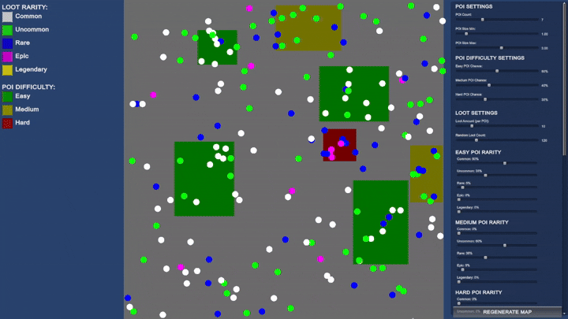

# LootMapGenerator

## Overview

**LootMapGenerator** is a Unity tool that procedurally generates **Points of Interest (POIs)** and **Loot Locations** across a map.

---

## Tutorial

1. Open the project in Unity.
2. Press the **Play** button.
3. Adjust generation parameters:
   - In the in-game **settings panel**, or  
   - By selecting either `LootManager` or `PoiGenerator` in the **Hierarchy** and modifying their settings.

Parameter changes will immediately affect how POIs and loot are generated across the map.

---

## Parameter Explanations

### POI Parameters

- `Poi Count` – Number of POIs on the map  
- `Poi Size Min` – Minimum size of the POI  
- `Poi Size Max` – Maximum size of the POI

#### POI Rarity Chances

- `Easy Poi Chance` – Chance of an easy POI spawning (ranges from 0–1)  
- `Medium Poi Chance` – Chance of a medium POI spawning (ranges from 0–1)  
- `Hard Poi Chance` – Chance of a hard POI spawning (ranges from 0–1)  
- `Island Size` – Dimensions of the island (x, y)  

### Loot Parameters

- `Loot Per POI` – Amount of loot generated in each POI  
- `Random Loot Count` – Amount of loot generated outside the POI  
- `Island Size` – Dimensions of the island (x, y)  

#### Easy POI Rarity Chances

- `Easy Common Chance` – Percentage of common loot spawning in easy POI (0–100%)  
- `Easy Uncommon Chance` – Percentage of uncommon loot spawning in easy POI (0–100%)  
- `Easy Rare Chance` – Percentage of rare loot spawning in easy POI (0–100%)  
- `Easy Epic Chance` – Percentage of epic loot spawning in easy POI (0–100%)  
- `Easy Legendary Chance` – Percentage of legendary loot spawning in easy POI (0–100%)  

#### Medium POI Rarity Chances

- `Medium Common Chance` – Percentage of common loot spawning in medium POI (0–100%)  
- `Medium Uncommon Chance` – Percentage of uncommon loot spawning in medium POI (0–100%)  
- `Medium Rare Chance` – Percentage of rare loot spawning in medium POI (0–100%)  
- `Medium Epic Chance` – Percentage of epic loot spawning in medium POI (0–100%)  
- `Medium Legendary Chance` – Percentage of legendary loot spawning in medium POI (0–100%)  

#### Hard POI Rarity Chances

- `Hard Common Chance` – Percentage of common loot spawning in hard POI (0–100%)  
- `Hard Uncommon Chance` – Percentage of uncommon loot spawning in hard POI (0–100%)  
- `Hard Rare Chance` – Percentage of rare loot spawning in hard POI (0–100%)  
- `Hard Epic Chance` – Percentage of epic loot spawning in hard POI (0–100%)  
- `Hard Legendary Chance` – Percentage of legendary loot spawning in hard POI (0–100%)  

#### Random Loot Rarity Chances

- `Random Common Chance` – Percentage of common loot spawning outside of a POI (0–100%)  
- `Random Uncommon Chance` – Percentage of uncommon loot spawning outside of a POI (0–100%)  
- `Random Rare Chance` – Percentage of rare loot spawning outside of a POI (0–100%)  
- `Random Epic Chance` – Percentage of epic loot spawning outside of a POI (0–100%)  
- `Random Legendary Chance` – Percentage of legendary loot spawning outside of a POI (0–100%)  

---

## Example Outputs

---

## Limitations

- The system currently supports five loot rarities:
  - **Common**
  - **Uncommon**
  - **Rare**
  - **Epic**
  - **Legendary**
- Rarity tiers are fixed and require code modification to expand or adjust.
- Loot/POI generation only works within a square area.
- POI shapes support randomly sized rectangles only. To fix a POI to a specific size, set `Poi Size Min` and `Poi Size Max` to the same value.
